# Sherlock PoC

This repository contains a small proof-of-concept incident triage system (backend + frontend) that demonstrates lightweight log collectors, evidence correlation, and an LLM-based root-cause analysis (RAG) pipeline.

This README documents the project, environment variables, how to run locally using Docker/Docker Compose, and troubleshooting guidance.

**Project layout**
- `backend/`: FastAPI backend service (main application code, Dockerfile, requirements)
- `frontend/`: Static/frontend code for UI (served separately)
- `model_data/`: Example data used by backend (deploy stubs and sample logs)
- `docker-compose.yml`: Compose configuration for running both services together

## Architecture Diagram



## Project structure

```
sherlock-simple/
├─ backend/
│  ├─ app/
│  │  ├─ main.py          # FastAPI server
│  │  ├─ rag.py           # RAG + OpenAI / Azure integration
│  │  ├─ collectors.py    # synthetic log & deploy generators, search
│  │  ├─ correlation.py   # simple ranking/correlation logic
│  │  ├─ utils.py         # validation + audit helpers
│  ├─ Dockerfile
│  ├─ requirements.txt
│  └─ model_data/         # persisted demo logs + deploy stubs (bind-mounted)
├─ frontend/
│  ├─ (React + static build served via nginx)
│  └─ Dockerfile
├─ docker-compose.yml
└─ .env                  # Store API key and other endpoint info
```

## Notes / How components interact

- Frontend sends queries to Backend (`/triage`) and displays results.
- Backend collects logs from `model_data/` (or generated via `/generate_sample`), correlates evidence, and (optionally) calls an LLM via `rag.py`.
- LLM calls use either Azure OpenAI (preferred if AZURE_* env vars present) or OpenAI SaaS (if `OPENAI_API_KEY` present). Use `SKIP_EMBEDDINGS=1` to avoid heavy ML dependencies.
- Docker Compose orchestrates `frontend` and `backend` services and mounts `model_data` as a persistent volume.

**What it does**
- Collects fabricated logs and deploy stubs (`/generate_sample`).
- Searches and correlates evidence for a query (`/triage`).
- Calls an LLM (Azure OpenAI or OpenAI SaaS) to produce a structured JSON root-cause analysis (RCA).

**Prerequisites**
- Docker and Docker Compose installed on your machine.
- Optional: an OpenAI API key (for OpenAI SaaS) or Azure OpenAI resource (endpoint, key, deployment) if you want live LLM responses.

Quick checks:
```bash
docker --version
docker compose version
```

**Environment variables**
Create a `.env` file in the repository root (an example is included). The application reads these variables via `docker-compose`.

- `OPENAI_API_KEY` : (optional) OpenAI SaaS API key. If set, the backend can call the OpenAI API.
- `AZURE_OPENAI_ENDPOINT` : (optional) Azure OpenAI resource endpoint (e.g. `https://<resource>.openai.azure.com/`).
- `AZURE_OPENAI_KEY` : (optional) Azure OpenAI API key.
- `AZURE_OPENAI_DEPLOYMENT` : (optional) Azure deployment name (e.g. `gpt-4o-mini`).
- `AZURE_OPENAI_API_VERSION` : (optional) API version for Azure; default in compose is `2024-02-01` or `2024-12-01-preview`.
- `SKIP_EMBEDDINGS` : Set to `1` to skip loading local embedding model and avoid heavy ML dependencies (default safe for development).

Notes:
- The backend now accepts either an `OPENAI_API_KEY` (OpenAI SaaS) OR the Azure triple (`AZURE_OPENAI_ENDPOINT`, `AZURE_OPENAI_KEY`, `AZURE_OPENAI_DEPLOYMENT`). If neither is present the service will refuse to start.

**Running with Docker Compose (recommended)**

1. Build and start services:
```bash
docker compose up --build
```

2. Or run detached:
```bash
docker compose up -d --build
```

3. View logs for the backend:
```bash
docker compose logs -f backend
```

The backend is exposed on `http://localhost:8000` and the frontend on `http://localhost:3000` by default.

**Run backend only (docker)**

1. Build image from `backend/`:
```bash
cd backend
docker build -t sherlock-backend:local .
```

2. Run container (with minimal runtime config, skipping embeddings):
```bash
cd backend
sudo docker run --rm -d -p 8000:8000 \
  -e SKIP_EMBEDDINGS=1 \
  -e OPENAI_API_KEY="$OPENAI_API_KEY" \
  -v "$(pwd)/model_data":/app/model_data \
  --name sherlock-backend sherlock-backend:local
```

3. If you use Azure OpenAI instead of OpenAI SaaS, pass the AZURE_* env vars instead (or in `.env` used by compose):
```bash
sudo docker run --rm -d -p 8000:8000 \
  -e AZURE_OPENAI_ENDPOINT="$AZURE_OPENAI_ENDPOINT" \
  -e AZURE_OPENAI_KEY="$AZURE_OPENAI_KEY" \
  -e AZURE_OPENAI_DEPLOYMENT="$AZURE_OPENAI_DEPLOYMENT" \
  -e SKIP_EMBEDDINGS=1 \
  -v "$(pwd)/model_data":/app/model_data \
  --name sherlock-backend sherlock-backend:local
```

**Development workflow (live code edits)**
- Use a bind-mount for the `backend/app` directory so code changes take effect without rebuilding the image. Restart the container after edits.

Example (dev run):
```bash
cd backend
sudo docker run --rm -it -p 8000:8000 \
  -e SKIP_EMBEDDINGS=1 \
  -e OPENAI_API_KEY="$OPENAI_API_KEY" \
  -v "$(pwd)/model_data":/app/model_data \
  -v "$(pwd)/app":/app/app \
  --name sherlock-backend-dev sherlock-backend:local
```

**API: Endpoints & Examples**
- `GET /` : health and endpoints listing.

- `POST /generate_sample` : generate synthetic logs and deploys for demo. Body (JSON):
```json
{ "scenario": "pool", "count": 10 }
```

- `POST /triage` : main triage endpoint. Body (JSON):
```json
{
  "query": "Connection pool exhausted",
  "time_window_minutes": 60,
  "max_evidence": 6
}
```

Curl examples:
```bash
curl http://localhost:8000/

curl -X POST http://localhost:8000/generate_sample \
  -H "Content-Type: application/json" \
  -d '{"scenario":"pool","count":3}'

curl -X POST http://localhost:8000/triage \
  -H "Content-Type: application/json" \
  -d '{"query":"Connection pool exhausted","time_window_minutes":60}'
```

**Enabling local embeddings (heavy)**
- If you want local embedding support (RAG vector search) restore heavy ML dependencies in `backend/requirements.txt`:
  - `sentence-transformers`, `torch`, `faiss-cpu`, etc.
- Rebuild the Docker image. Be aware this increases build time, image size, and requires more disk space and memory.

**Troubleshooting**
- `RuntimeError: OPENAI_API_KEY environment variable must be set` — The backend now accepts Azure credentials as an alternative. Ensure either `OPENAI_API_KEY` or the Azure triple (`AZURE_OPENAI_ENDPOINT`, `AZURE_OPENAI_KEY`, `AZURE_OPENAI_DEPLOYMENT`) is present in the environment.
- `LLM call failed: Connection error` with `socket.gaierror: [Errno -2] Name or service not known` — typically DNS or malformed endpoint. Check that `AZURE_OPENAI_ENDPOINT` is a reachable URL (e.g. `https://<resource>.openai.azure.com`) and that container DNS can resolve it. Try `nslookup <host>` from inside a container to validate.
- `no space left on device` during image build — heavy ML packages can produce large images. Free disk space or remove heavy deps and use `SKIP_EMBEDDINGS=1` for lightweight builds.

**Testing & development tips**
- The backend includes simple unit-testable functions in `backend/app` (e.g., `collectors.search_logs`, `correlation.correlate_evidence`). You can add tests and run them in a local venv.

**Contribution & notes**
- This repository is a minimal POC and not production hardened. Treat LLM outputs as advisory and validate before acting on them.

If you want, I can also add a `backend/README.md` (service-specific) with quick dev commands and a `requirements-ml.txt` for the heavy build path.

*** End of README ***

*** License and attribution***
This project is provided as-is for demonstration purposes.
